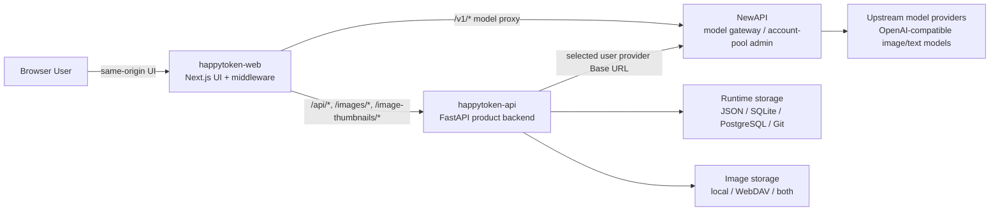
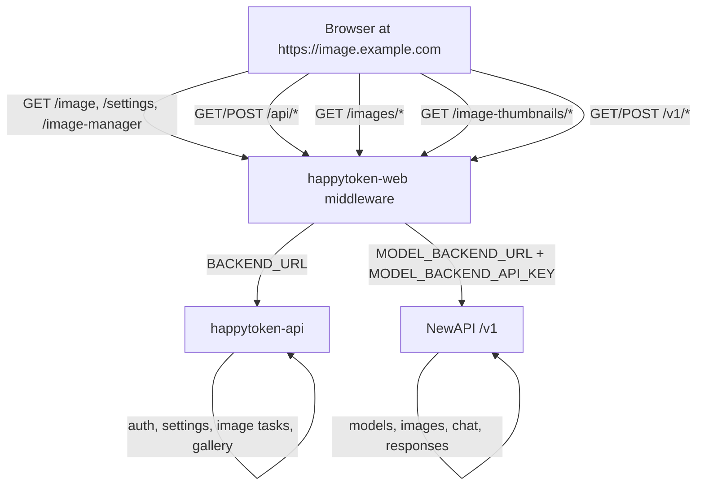
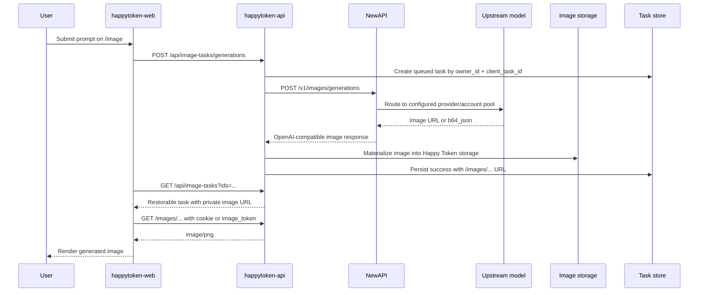
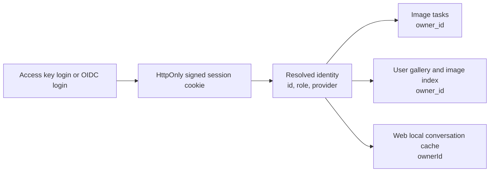
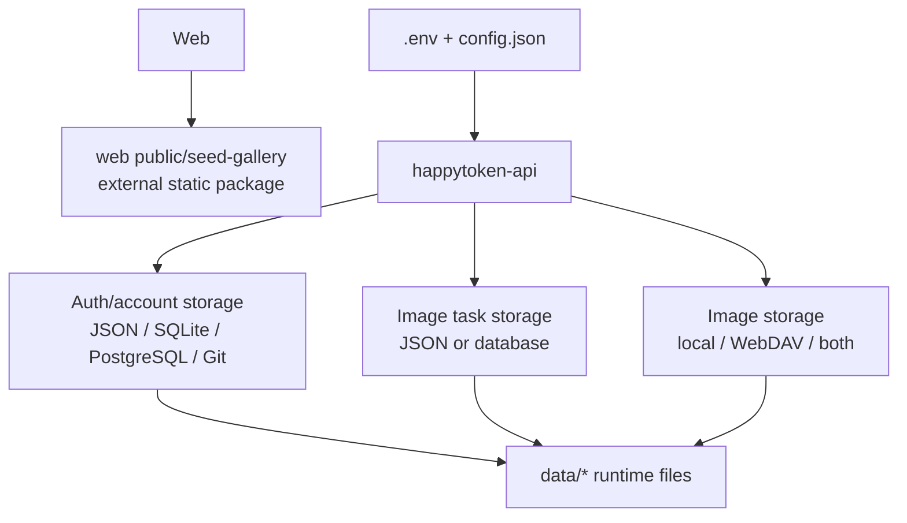
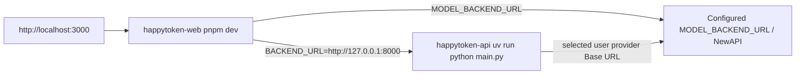
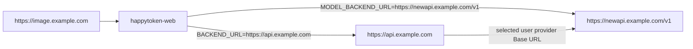

# Architecture

This document is the visual entry point for the current Happy Token split architecture. It focuses on the recommended deployment where Happy Token Web owns the browser experience, Happy Token API owns product state, and NewAPI owns model gateway/account-pool operations.

## System Context



Key boundary:

- `happytoken-web` is the browser-facing app and proxy layer.
- `happytoken-api` is the product-state owner for auth, sessions, image tasks, user gallery, private image links, logs, and settings.
- `NewAPI` is only the model gateway/account-pool management layer.

## Route Split



Recommended browser configuration:

| Browser route | Web middleware target | Why |
|:--|:--|:--|
| `/api/*` | `BACKEND_URL` | Product APIs, login, settings, task history, gallery. |
| `/images/*` | `BACKEND_URL` | Private signed generated images. |
| `/image-thumbnails/*` | `BACKEND_URL` | Private thumbnails. |
| `/v1/*` | `MODEL_BACKEND_URL` | OpenAI-compatible model calls. |

Do not set `NEXT_PUBLIC_API_BASE_URL` in same-origin proxy mode. Leave browser calls relative so cookies, task restore, and private image URLs stay on the same origin.

## Image Generation Data Flow



Important behavior:

- `client_task_id` makes image task submission idempotent.
- If the gateway returns a temporary remote `data[].url`, Happy Token API downloads and saves it before exposing the result.
- Historical successful images are resynced by `taskId`, so stale or expired URLs can be replaced by the latest task data.
- If the current user has no selected provider with Base URL and API Key, image generation fails clearly instead of falling back to server `.env` credentials or local account pools.

## Authentication And Ownership



Ownership rules:

- API identity is resolved from Bearer token or signed web session cookie.
- Image task records are keyed by `owner_id`.
- Web conversation cache is scoped by `ownerId`.
- Users can restore only their own image tasks and gallery items.

## Storage Model



Version-control boundary:

| Path | Git policy |
|:--|:--|
| `.env`, `config.json` | Never commit; deployment-specific secrets and settings. |
| `data/images`, `data/image_tasks.json`, `data/auth_keys.json`, `data/accounts.json`, logs | Never commit; runtime data and secrets. |
| `happytoken-web/public/seed-gallery/*` | Do not commit; generated or mounted official gallery static package. |
| `.next`, `.open-next`, `out`, `.pytest_cache`, `__pycache__`, `.worktrees` | Generated or temporary; safe to delete. |

## Deployment Modes

### Local Development



Use:

```bash
BACKEND_URL=http://127.0.0.1:8000
MODEL_BACKEND_URL=https://newapi.example.com/v1
MODEL_BACKEND_API_KEY=<newapi-token>
NEXT_PUBLIC_EXTERNAL_MODEL_ADMIN=true
```

Keep `NEXT_PUBLIC_API_BASE_URL` empty.

### Production Split Deployment



Set stable public URLs:

```bash
HAPPYTOKEN_FRONTEND_BASE_URL=https://image.example.com
HAPPYTOKEN_API_BASE_URL=https://api.example.com
HAPPYTOKEN_CORS_ORIGINS=https://image.example.com
```

## Verification Checklist

```bash
uv run pytest -q test/test_config.py test/test_image_task_service.py test/test_image_tasks_api.py test/test_newapi_gateway_chain.py
pnpm run test:unit
pnpm exec tsc --noEmit
WEB_URL=http://127.0.0.1:3000 API_URL=http://127.0.0.1:8000 HAPPYTOKEN_USER_TOKEN=<token> ./scripts/verify-newapi-model-chain.sh
```

Browser smoke:

1. Open `/image`.
2. Generate one image.
3. Confirm task reaches `已完成`.
4. Confirm the result renders as an image, not `图片无法加载`.
5. Reload `/image`; confirm the same historical result still renders.
